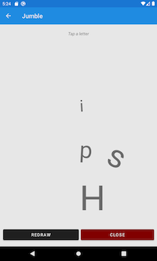

#  Xamarin Forms Mvvm Adaptor
**ViewModel-First** Mvvm framework for Xamarin.Forms. Lightweight, it adapts Xamarin's existing Mvvm engine.

[](https://www.nuget.org/packages/XamarinFormsMvvmAdaptor/)    [?branchName=master)](https://dev.azure.com/guy-antoine/xamarin-forms-mvvm-adaptor/_build/latest?definitionId=2&branchName=master) [](https://www.myget.org/feed/zeebz-open-source/package/nuget/XamarinFormsMvvmAdaptor)


## Why?

This library was inspired by the [Enterprise Application Patterns Using Xamarin.Forms](https://docs.microsoft.com/en-us/xamarin/xamarin-forms/enterprise-application-patterns/) eBook.

Xamarin has fantastic Mvvm functionality, however the pattern is geared towards View-First navigation. I prefer to keep the View "dumb", and put all my logic in the ViewModel. This library allows you to use the Xamarin engine with a ViewModel-First pattern, keeping a strong separation of concerns and more readable code. Using this library, you will find that its rare that you need to put anything in your `.xaml.cs` code-behind files.

**Features:**

* Familiar syntax, e.g. `PushAsync<TViewModel>()` is similar to Xamarin's `PushAsync(Page page)`
* Easily pass data to the appearing view-model with `PushAsync<TViewModel>(object navigationData)`
* `OnAppearingAsync()` method within the view-model is triggered automatically when its associated page appears at the top of the stack.
* Supports full dependency injection with the DI engine of your choice.
* Supports multiple navigation-stacks. Useful if you want each tab of a TabbedPage to have its own separate navigation tree.
* Lightweight because its adapts Xamarin's existing engine.

## Getting Started

MvvmAdaptor can be consumed in **two flavours**:

* [Vanilla](#Vanilla-implementation) implementation
* [With DI](#DI-implementation) implementation (using Dependency Injection / IoC Engine of your choice)

Skip to the flavour that suits you.

### Vanilla implementation

**Instantiate the controller as a single instance**. One way to do this is with a static property in your `app.xaml.cs` file:

```c#
public partial class App : Application
{
  public static NavController NavController { get; } = new NavController();
```

You would access the NavController by calling `App.NavController` anywhwere in your application.

Another way would be to use a dependency service. If you prefer this approach, you will probably be consuming the [Dependency Injection (DI)](#DI-implementation) flavour.


**Keep to the following naming conventions**. The MvvmAdaptor works by assuming that you name your View and ViewModel classes consistently. The default expectation is that:

* Views end with the <u>suffix 'Page'</u>, and view-models with the <u>suffix 'ViewModel'</u>. For example `MainPage` and `MainViewModel`.
* All views are in the <u>`.Views` sub-namespace</u>, and view-models in the <u>`.ViewModels` sub-namespace</u>. For example: MainPage will be in the `MyApp.Views` namespace, and MainViewModel will be in the `MyApp.ViewModels` namespace.

You can change the expected naming convention to your personal style with the `SetNamingConventions()` method.


**ViewModels must implement the `IAdaptorViewModel` interface**. The easiest way to achieve this is to extend the `AdaptorViewModel`. This has the added benefit of including all the mvvm boilerplate code and more because it uses James Montemagno's [MvvmHelpers](https://github.com/jamesmontemagno/mvvm-helpers) as a dependency.

```c#
public class MainViewModel : XamarinFormsMvvmAdaptor.AdaptorViewModel
	{
```

Alternatively, you can roll your own BaseViewModel. Note that the two interface methods:

* Are marked `virtual` so that you can `override` them in your derived view-model classes.
* Return `Task.FromResult(false);` as the default implementation.

```c#
public abstract class BaseViewModel : IAdaptorViewModel
{
    public virtual Task InitializeAsync(object navigationData)
    {
        return Task.FromResult(false);
    }

    public virtual Task OnAppearingAsync()
    {
        return Task.FromResult(false);
    }
  
  // Add your own implementations of INotifyPropertyChanged, and custom code
  // ...
}
```


In your view-model instance, if your override implementation of `InitializeAsync()` or `OnAppearingAsync()` is synchronous, you can just return the task `base.InitializeAsync(null)`:

```c#
public override Task InitializeAsync(object navigationData)
{
  DoSomeSynchronousWork(navigationData as MyDocument);
    
  return base.InitializeAsync(null);
}
```


**Bind to your view-model as you normally would** with Xamarin. I prefer to link in the xaml file so that intellisense picks up your bindings.

```xaml
<ContentPage xmlns="http://xamarin.com/schemas/2014/forms"
             ... 
             xmlns:vm="clr-namespace:MyApp.ViewModels"/>
  <ContentPage.BindingContext>
      <vm:MainViewModel/>
  </ContentPage.BindingContext>
	
	<ContentPage.Content>
    ...
```


**Initialize the RootViewModel** by running `InitAsync()` in the `OnStart()` override.

**And set you app's MainPage** to your NavController's NavigationRoot. 

```c#
public partial class App : Application
{
	...	
  protected override async void OnStart()
  {
    //Important to initialize before setting the MainPage
    await NavController.InitAsync(new MainPage());
    MainPage = NavController.NavigationRoot;
  }

```


**Start Navigating!** 

Navigate forwards from your view-models as follows:

```c#
//To Push
await App.NavController.PushAsync<DetailViewModel>();
//or, if you want to pass data
await App.NavController.PushAsync<DetailViewModel>(listItem);

//MODAL NAVIGATION
await App.NavController.PushModalAsync<DetailViewModel>();
```

Navigate backwards with pop:

```c#
//To Pop
await App.NavController.PopAsync();

//MODAL NAVIGATION
await App.NavController.PopModalAsync();
```

Checkout the [Navigation](#Navigation) section for a menu of the additional navigation properties and methods.

Checkout the [WordJumble Sample App](#WordJumble) for a simple example that uses this framework.

***

### DI implementation

If you look at the [WordJumble Sample App](#WordJumble), you will notice that the DI-flavour looks like more work than the Vanilla option. This is the price you pay for a more testable, and more maintainable app. 

I could have trimmed some of the code requirement if I bundled a DI-engine into the MvvmAdaptor. Instead, I believe its more important to let you work with your DI-engine of choice. Here, I use [AutoFac](https://autofac.org) as an example.


**Keep to the following naming conventions**. The MvvmAdaptor works by assuming that you name your View and ViewModel classes consistently. The default expectation is that:

* Views end with the <u>suffix 'Page'</u>, and view-models with the <u>suffix 'ViewModel'</u>. For example `MainPage` and `MainViewModel`.
* All views are in the <u>`.Views` sub-namespace</u>, and view-models in the <u>`.ViewModels` sub-namespace</u>. For example: MainPage will be in the `MyApp.Views` namespace, and MainViewModel will be in the `MyApp.ViewModels` namespace.

You can change the expected naming convention to your personal style with the `SetNamingConventions()` method.


**ViewModels must implement the `IAdaptorViewModel` interface**. The easiest way to achieve this is to extend the `AdaptorViewModel`. This has the added benefit of including all the mvvm boilerplate code (and more) because it uses James Montemagno's [MvvmHelpers](https://github.com/jamesmontemagno/mvvm-helpers) as a dependency.

```c#
public class MainViewModel : XamarinFormsMvvmAdaptor.AdaptorViewModel
```

Alternatively, you can roll your own BaseViewModel. Note in the example below that the two interface methods:

* Are marked `virtual` so that you can `override` them in your derived view-model classes.
* Return `Task.FromResult(false);` as the default implementation.

```c#
public abstract class BaseViewModel : IAdaptorViewModel
{
    public virtual Task InitializeAsync(object navigationData)
    {
        return Task.FromResult(false);
    }

    public virtual Task OnAppearingAsync()
    {
        return Task.FromResult(false);
    }
  
  // Add your own implementations of INotifyPropertyChanged, and custom code
  // ...
}
```

In your view-model instance, if your override implementation of `InitializeAsync()` or `OnAppearingAsync()` is synchronous, you can just return the task `base.InitializeAsync(null)`:

```c#
public override Task InitializeAsync(object navigationData)
{
  DoSomeSynchronousWork(navigationData as MyDocument);
    
  return base.InitializeAsync(null);
}
```


**Use DI in your ViewModel constructors**. Here is an example from the [WordJumble Sample App](#WordJumble). Note that the NavController itself is injected as a dependency, allowing you to easily stub this service in your tests.

```c#
public class JumbleViewModel : XamarinFormsMvvmAdaptor.AdaptorViewModel
{
  readonly IFlexiCharGeneratorService flexiCharGenerator;
  readonly INavController navController;

  //ViewModel Constructor with Dependency Injection
  public JumbleViewModel(INavController navController, 
                         IFlexiCharGeneratorService flexiCharGeneratorService)
    {
        flexiCharGenerator = flexiCharGeneratorService;
        this.navController = navController;
    ...

```


**No need to set the binding-context in your Views.** MvvmAdaptor will do this for you. 

> Tip: If you want intellisense to pick up bindings in your xaml, you need to give it a view-model. You can use [design time data](https://docs.microsoft.com/en-us/xamarin/xamarin-forms/xaml/xaml-previewer/design-time-data) to do this. Notice the `:d` namespace in the snippet below. If you go this route, you will need two constructors in your view-models. An empty one to satisfy the xaml, and your primary one with all the dependencies. Autofac works on the principle of "greediest" constructor, so it will pick the right one automatically. Most DI engines follow this default.
>
> ```xaml
> <ContentPage xmlns="http://xamarin.com/schemas/2014/forms"
>              xmlns:mc="http://schemas.openxmlformats.org/markup-compatibility/2006"
>              xmlns:d="http://xamarin.com/schemas/2014/forms/design"
>              xmlns:vm="clr-namespace:MyApp.ViewModels"/>
> <!-- This is optional -->
>   <d:ContentPage.BindingContext>
>       <vm:MainViewModel/>
>   </d:ContentPage.BindingContext>
> 	
> 	<ContentPage.Content>
>     ...
> ```
>


**Set up the DI container.** Make it accessible throughout your project as a single instance. One way to do this is with a static property in your `app.xaml.cs` file:

```c#
public partial class App : Application
{
  //This will be accessible throughout the app
  public static IContainer DiContainer { get; private set; }

public App()
{
  InitializeComponent();

  // Set up the container for Dependency Injection
  var builder = new ContainerBuilder();
  // Add services
  builder.RegisterType<FlexiCharGeneratorService>()
    .As<IFlexiCharGeneratorService>().SingleInstance();
  // Add view-models
  builder.RegisterType<MainViewModel>().AsSelf();
  builder.RegisterType<JumbleViewModel>().AsSelf();
  builder.RegisterType<FlexiCharDetailViewModel>().AsSelf();
  // Add the NavController
  builder.RegisterType<NavController>()
    .As<INavController>().SingleInstance();
  DiContainer = builder.Build();
}
```

You can now access the DiContainer by calling `App.DiContainer` anywhwere in your application.

**Initialize the RootViewModel** by running `DiInitAsync()` in the `OnStart()` override.

**And set you app's MainPage** to your NavController's `NavigationRoot`. 

```c#
public partial class App : Application
{
	...	
  protected override async void OnStart()
  {
    var navController = DiContainer.Resolve<INavController>();
    //Important to initialize before setting MainPage
    await navController.DiInitAsync(DiContainer.Resolve<MainViewModel>());
    MainPage = navController.NavigationRoot;
  }
```


**Start Navigating!** 

Navigate forwards from your view-models as follows:

```c#
public class JumbleViewModel : XamarinFormsMvvmAdaptor.AdaptorViewModel
{
  ...
  readonly INavController navController;

  //Constructor
  public JumbleViewModel(INavController navController)
  {
    this.navController = navController;
  }

  async Task Navigate()
  {
    ...
    //To Push
    await navController.DiPushAsync(
      App.DiContainer.Resolve<FlexiCharDetailViewModel>());

    //or, if you want to pass data
    await navController.DiPushAsync(
      App.DiContainer.Resolve<FlexiCharDetailViewModel>(),navigationData);

    //MODAL NAVIGATION
    await navController.DiPushModalAsync(
      App.DiContainer.Resolve<FlexiCharDetailViewModel>());
```

Navigate backwards with pop:

```c#
//To Pop
await navController.PopAsync();

//Pop Modal
await navController.PopModalAsync();
```

Checkout the [Navigation](#Navigation) section for a menu of the additional navigation properties and methods.

Checkout the [WordJumble Sample App](#WordJumble) for a simple example that uses this framework.

***

### Navigation

The Navigation framework simply follows the Xamarin.Forms approach. If you are unfamiliar or rusty, please refer to Microsoft's docs on [Performing Navigation](https://docs.microsoft.com/en-us/xamarin/xamarin-forms/app-fundamentals/navigation/hierarchical#performing-navigation) (10min read). In addition to the familar methods, I have added some [additional stack manipulation helpers](#Additional-helpers).

#### Available in Xamarin.Forms:

* Properties
  * NavigationStack (called MainStack here)
  * ModalStack
  * RootPage
  * CurrentPage
* Methods:
  * PushAsync & PushModalAsync
  * PopAsync & PopModalAsync
  * InsertPageBefore
  * RemovePage

#### Additional helpers:

* Properties :
  * TopPage
  * HiddenPage (see [detail](#Shortcuts-for-accessing-Pages-and-ViewModels-in-the-stack) below for explaination) in addition to RootPage and TopPage
  * RootViewModel, TopViewModel, and HiddenViewModel corresponding to the pages above
* Extension methods on the MainStack and ModalStack
  * GetCurrentPage() and GetCurrentViewModel()
  * GetPreviousPage() and GetPreviousViewModel()
* Methods:
  * CollapseMainStack()
  * RemovePreviousPageFromMainStack()
* Static methods that don't need a NavController instance:
  * DiCreatePageForAsync(IAdaptorViewModel viewmodel)


#### Shortcuts for accessing Pages and ViewModels in the stack

The image below represents a stack of four pages, with labels corresponding
to properties that allow you to access these pages or their corresponding
view-models. The Top, and Root pages are self-explanatory. The Hidden page is
always beneath the Top page. It is 'hidden' by the top page, and will always
be the <u>first to appear when the Top page is popped off the stack</u>.


This last point is important to consider if you have pages in a modal stack. Remember that the modal-stack always hides the navigation-stack. If there is one page in the modal-stack, the hidden page is at the top of the navigation-stack (see below), as it will appear next when the modal stack is popped.


If the modal stack has two pages, the 'hidden' page is beneath the top page of the modal-stack (figure below) because it will appear next when the top modal page is popped.


For any other pages you can always specify the index of the stack:

```c#
// To access a page
Page page = NavController.MainStack[3];

// To access it's corresponding viewmodel
var viewModel = page.BindingContext as IAdaptorViewModel;
```


## Sample App

### WordJumble

On the MainPage the user types a four letter word into an entry dialogue. A new page appears with the word's letters jumbled randomly on the page. The user can tap a letter to open a dialogue which lets them rotate the letter differently.

| iOS                                                  | Droid                                                |
| :--------------------------------------------------: | :--------------------------------------------------: |
|  |  |

WordJumble demonstrates both flavours of the XamarinFormsMvvmAdaptor. When [browsing the code](SampleApps/WordJumble), look for the conditional compilation symbol `#if WITH_DI` for the the [DI flavour](#DI-implementation) of XamarinFormsMvvmAdaptor. If building the app, be aware of what configuration you are building.

This app demonstrates:

* Initialising the Navigation Controller
* Push a page onto the stack from the view-model
  * Passing data to that page (the user-entered word),
  * Triggering the WordJumbleViewModel's `InitializeAsync()` method
* Push a modal page onto the modal stack
  * Again passing data to the modal page
* `OnAppearing()` triggered in the WordJumbleViewModel when the user has finished rotating the letter in the modal dialogue
* Popping of pages

In addition to XamarinFormsMvvmAdaptor, the sample uses the following features which you may or may-not be familiar with:

* Xamarin.Forms Material Visual: [docs here](https://docs.microsoft.com/en-us/xamarin/xamarin-forms/user-interface/visual/material-visual) , and [blog here](https://devblogs.microsoft.com/xamarin/beautiful-material-design-android-ios/).
* DesignTime Data (great with Xaml Hot Reload): [docs here](https://docs.microsoft.com/en-us/xamarin/xamarin-forms/xaml/xaml-previewer/design-time-data) , and [blog here](https://montemagno.com/xamarin-forms-design-time-data-tips-best-practices/).
* [AutoFac](https://autofac.org) for the dependecy injection.

